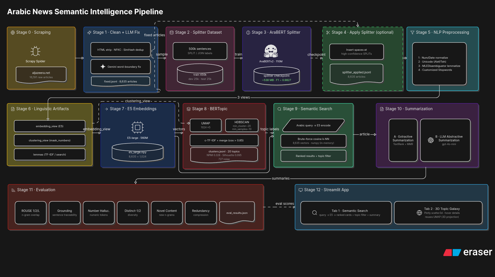

# ArabicSeek — Arabic News NLP Pipeline

An end-to-end Arabic NLP system over an Arabic news corpus: **scrape → preprocess → embed → cluster → summarize → evaluate**, served through a Streamlit app for semantic search and an interactive 3D topic galaxy.

<p align="center">
  
</p>

---

## ✨ Features

| Stage                   | What it does                                                                                                                       |
| ----------------------- | ---------------------------------------------------------------------------------------------------------------------------------- |
| **Scraping**      | Collects Arabic news articles via RSS + sitemap, with deduplication and JSONL storage.                                             |
| **Preprocessing** | Arabic cleaning, number/date masking, and MLE lemmatization (CAMeL-Tools).                                                         |
| **Embeddings**    | Sentence embeddings with `intfloat/multilingual-e5-large` (L2-normalized).                                                       |
| **Clustering**    | Topic modeling with BERTopic (UMAP + HDBSCAN) and clean Arabic topic labels from c-TF-IDF.                                         |
| **Summarization** | Faithful**extractive** summaries (TextRank / MMR over E5 — local & free), plus an optional **OpenAI** summary.        |
| **Evaluation**    | Clustering coherence (NPMI, silhouette, diversity) and summarization metrics (ROUGE-1/2/L, grounding, hallucination, compression). |
| **App**           | Dark, RTL Streamlit dashboard: semantic search + a 3D topic galaxy that follows your query.                                        |

---

## 📂 Project layout

```
src/arnlp/        # pipeline library (scraping, preprocessing, embeddings, clustering, summarization, evaluation)
scripts/          # CLI entry points to run each stage
app/              # Streamlit semantic-search UI (see app/README.md)
configs/          # YAML configs (default / dev / prod)
data/             # corpus, embeddings, clusters  (gitignored)
models/           # cached models                 (gitignored)
tests/            # pytest suite
```

---

## 🚀 Setup

```bash
python -m venv .venv && source .venv/bin/activate
pip install -r requirements.txt
pip install -e .                     # installs the `arnlp` package
cp .env.example .env                 # optional: set OPENAI_API_KEY for LLM summaries
```

Requires **Python 3.10+**.

---

## 🛠️ Run the pipeline

```bash
python scripts/run_preprocess.py     # clean + lemmatize raw articles
python scripts/run_embeddings.py     # encode with E5
python scripts/run_clustering.py     # BERTopic topics + labels
```

Each stage reads its paths and options from `configs/default.yaml` (override with `configs/dev.yaml` / `configs/prod.yaml`).

---

## 💻 Run the app

```bash
streamlit run app/streamlit_app.py   # from the repo root
```

Heavy models load **lazily** — data and the galaxy are instant; the ~2 GB E5 model loads on your first search. The optional OpenAI summary needs `OPENAI_API_KEY` in the environment. See [`app/README.md`](app/README.md) for the full UI walkthrough.

**The app gives you:**

- 🔎 **Semantic search** — encodes your Arabic query with E5 and ranks news by cosine similarity, with topic chips and per-article summaries.
- 🌌 **3D topic galaxy** — a UMAP→3D projection colored by topic; search results light up and their cluster is spotlighted.

---

## 📄 License

MIT
